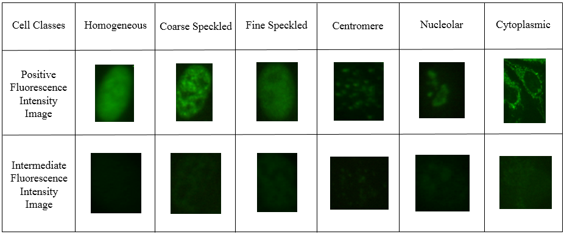

# HEp-2_cell_classification
This repository includes my research on medical image analysis. Specifically, this work is to classify HEp-2 cell, i.e. Laryngeal cancer classification.

Our experiments were conducted on two competition datasets: ICPR2012 and ICPR2014 competition. All images in these two datasets are divided into two parts: positive and intermediate, as
shown in the following figure. More specifically, the training and test sets contain (721, 734) and (10877, 2719) images respectively.

Our method contains two parts, i.e. train and test. As for training, our framework is based on VGG16, but we remove FC4096+FC4096 to simplify our network for avoiding overfitting because of small datasets. Then, we train our model with the training set and get a model. Note that before training we get a pre-trained model which is trained on ImageNet dataset. After that, we extract features from the last convolutional layer of our model and use them to train SVM classifier. For the testing stage, we combine SVM with the features extrated from the last convolutional layer of the fine-tuned VGG16. Our results are as follows.

##   Our experiments results on ICPR2012 dataset

 
 

##   Our experiments results on ICPR2014 dataset
